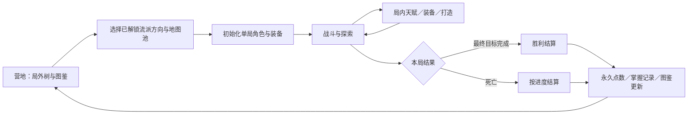

# MineWorld 玩法重构开发文档

版本：设计草案 v1 · 2026-09-10

本文定义下一阶段的目标玩法、实施依赖和验收标准，不代表相关功能已经实现。当前代码结构见 [ARCHITECTURE.md](ARCHITECTURE.md)。实施新玩法时以本文为方向；现状说明以实际代码为准。

## 1. 产品目标与范围

核心体验：发现并练成新流派，用局内天赋、装备技能和定向打造完成构筑，通过机制战斗通关，再开放新的流派方向与高阶地图池。

### 1.1 已确定的方向

- 局外天赋树负责长期解锁；胜利获得较多局外天赋点，死亡根据有效进度获得少量。
- 胜利附加有上限的低配置挑战奖励；同等进度下，死亡可根据本局实际角色成长获得少量补偿。两者不替代基础进度奖励，不直接用结算瞬间属性决定全部收益。
- 局内天赋树与装备技能组合是单局构筑核心；取消传送门处每层固定三选一专精。
- 单局装备不带出；金币、普通打造材料与局内等级也按单局资源处理。
- 红色装备可以点亮永久图鉴，提供后续增强与收集目标。
- 长期驱动力以尝试、练成新流派为主，并扩展高阶地图池。
- 战斗需要机制、敌人配合与应对空间；打造帮助玩家朝喜欢的流派推进。
- 地图与怪物的简陋、单一化是独立的核心缺陷：必须同时提升空间结构、场景辨识度、行为差异和遭遇变化，不能只换贴图、颜色或数值。
- 地图不固定为九宫格或九个房间，必须支持多种随机空间构造；固定的是可玩空间、主线时长与性能预算，不是网格布局。
- 前期只做粗模、灰盒和必要的占位贴图，优先验证地图、怪物、操作与玩法；正式模型、贴图及配套表现后续按同一美术风格统一制作和替换。
- 技能体系不能停留在当前五个技能：完整内容目标为几十种具有实质玩法差异的技能，覆盖专精与混合流派；最终以统一风格的华丽特效、动画和声音构成有层次的技能表演。前期先验证机制与基础提示，后期集中完成正式表现。
- 装备新增“传奇暗金”品质，比红装更稀有，主要来自高阶地图；强调独特功能、技能形态或外观变化，而非仅提升属性。全面检查已有装备、套装与词条的同质化和平衡，在玩法差异成立的前提下扩充内容。
- 召唤流包含多种可配合的召唤物，通过职责、指令、资源和触发规则形成不同编队与混合流派，不以重复增加同一种骷髅数量代替召唤深度。
- 最终交付包含代码解耦、可维护性和经过测量的性能优化。重构贯穿开发，正式内容完成后进行专项收尾；以行为正确、扩展成本、帧耗时、内存和加载表现验收，不承诺无法证明的“绝对最优”。
- 保留第三/第一人称、手机横屏优先和竖屏支持。
- 商店继续作为地图交互点，部分楼层随机出现，每三层至少一个；出售只在商店，背包保留整理、分解与打造。

### 1.2 本文提出的首版方案

以下属于开发默认方案，后续可随原型验证调整，不是已经确定的平衡数值：

- 三个基础流派：近战、火系、召唤；各有两个进阶方向。
- 两档地图池：基础与进阶；更高档预留扩展，不首发堆量。
- 一大局 25 层，每 5 层一次 Boss 战；第 5/10/15/20 层完成主线后可低收益提前结算，或保留本局装备与构筑继续深入，第 25 层完成最终目标才算完整胜利。
- 完整时长按 25 层结构重新观察；每 5 层提供一次阶段结算机会，不以无限扩大地图或拖长走路填充时间。
- 一个存档槽对应一个独立的局外档案和最多一局进行中的游戏；设置仍由 SettingsManager 全局管理。
- 高难度采用主动选择，不自动把新流派推入更难的地图。
- 红装先实现三件，每个基础流派一件，定位为机制装备；不是所有属性都高于其他装备。
- 技能完整版本暂以不少于 30 种独立技能为规划基线，具体名称和分配待设计清单细化；分阶段从少量可玩的技能扩展，技能变体与纯数值升级不用于凑足数量。
- 地图与怪物内容首版建议达到：两个有独立辨识度的场景主题、八个玩法不同的房间模板、六种行为可区分的普通敌人、六套遭遇组合，以及一个阶段 Boss 和一个最终 Boss。数量是内容预算建议，具体差异通过第 6 节验收，不以重复变体凑数。

### 1.3 首版不做

在线交易、赛季服务器、排行榜防作弊、跨玩家共享经济、巨大被动树、无限地图池、全套职业、完整剧情战役。先验证一段完整而值得重玩的流程。

## 2. 当前状态与需要替换的规则

| 当前实现 | 主要问题 | 目标改动 |
| --- | --- | --- |
| Game 持续增加楼层 | 缺乏明确的一局终点 | RunDefinition 定义阶段与最终目标 |
| 死亡扣 10% 金币并重建当前层 | 失败没有完整结算，可能重复刷同层收益 | 死亡终止本局，结算少量长期奖励 |
| BuildSystem 三种专精，各三级 | 九次选择后全部点满，构筑趋同 | 有总预算和关键分支取舍的局内天赋 |
| 现有天赋、加点、专精分别作用 | 成长来源分散，规则难解释 | 统一局内角色成长；局外树独立负责解锁 |
| 装备通过生成实例 id 标识 | 不适合作为永久图鉴主键 | 稳定内容 id 与实例 id 分离 |
| 整份 SaveData 混合角色、楼层和装备 | 无法清晰表达永久与单局数据 | Profile + ActiveRun + Settlement 存档模型 |
| 普通遭遇 3–4 只，精英主要额外生命 | 处理方式变化有限 | 引入敌人职责与组合机制 |
| 九宫格房间骨架和角色较固定 | 熟悉后路线容易变成惯例 | 在固定空间预算内增加模板、事件和奖励选择 |

保留已完成的镜头、触屏、库存保存、背包整理/分解、共享导航、投射物碰撞和缓存优化。新玩法不应以回退操作体验为代价。

## 3. 完整游戏循环



### 3.1 状态转换

`camp → preparing → playing ↔ paused → settling → summary → camp`

- 商店、天赋、背包作为 playing 上的暂停面板处理：统一冻结战斗、技能冷却、回血回蓝与世界计时，避免靠开面板恢复资源。
- 手机切后台自动暂停；恢复后清空按键和触点状态。
- 返回主菜单是保存并暂停当前局，不等于放弃；继续游戏恢复同一 runId。
- 显式放弃需要展示后果。首版建议保留已记录的首次图鉴发现，不发额外局外点，防止把放弃当作领奖快捷键。
- 提前结算使用独立的 `extracted` 终态，不算完整胜利，收益明显低于通关，装备资源同样不带出；只在当前 Boss 阶段主线完成后开放，继续下一层即关闭，等下一阶段重新取得资格。
- P2 按 25 层重新安排局内天赋点预算和成长节奏，替换现有仅 9 级的专精容量，让中后期仍有组合与强化选择。
- 胜利、提前结算与死亡只接受第一个有效终态；同帧发生时使用确定的事件顺序，禁止双重结算。默认最终目标完成事件先于随后伤害进入队列则判胜，反之判负。
- 死亡后不调用当前的 respawnAfterDeath 重开同层。

### 3.2 每局开始和结束的数据边界

| 数据 | 单局开始 | 单局结束 |
| --- | --- | --- |
| 局外天赋点、已解锁节点 | 保留 | 发放奖励并保留 |
| 流派掌握记录、地图池解锁 | 保留 | 更新符合条件的记录 |
| 红装图鉴、收藏外观 | 保留 | 保留首次发现与挑战完成状态 |
| 角色等级、局内天赋点、装备与技能装配 | 根据起始方案重新建立 | 清除本局状态，不转为永久装备 |
| 金币、材料、商店库存和次数 | 重置 | 清除，不折算为局外点 |
| 楼层、敌人、掉落、事件与随机状态 | 新 runId 和新种子 | 留摘要后清除运行状态 |
| 已完成但未确认的结算 | 阻止新开局覆盖 | 先展示并确认已有结算 |

新流派的起始装备必须足以使核心机制运作，不要求先刷另一流派才能获得入门所需物品。

## 4. 局外成长：解锁与掌握

### 4.1 天赋树结构

采用小型公共区域连接流派分支与挑战分支，不首发巨大网状树。

| 分支 | 入门节点 | 熟练节点 | 掌握节点 |
| --- | --- | --- | --- |
| 流派 | 核心技能、起始配置、局内节点池 | 技能变体、定向打造选项 | 带取舍的关键机制、相关挑战 |
| 探索 | 基础地图内容 | 新事件、奖励倾向选择 | 进阶地图池资格 |
| 收集 | 图鉴记录入口 | 专属装备寻找线索 | 变体、外观或特定节点解锁 |

- 首个基础流派免费开放，另外两个入门解锁成本较低，避免长期卡在同一种玩法。
- 解锁节点主要增加选择，不堆大量永久攻击、生命与爆率。
- 若增加稀有掉落加成，必须有明确上限，并验证新档也能合理接触核心内容；第一版可先不加全局爆率节点。
- 天赋点支付开放机会；掌握条件检验实际使用，如“使用该分支关键节点完成通关”。
- 掌握判定记录本局实际投入与使用，不能只在最后一刻切换起始标签领奖；不采用只有指定唯一配装才能完成的条件。
- 永久内容解锁首版不支持反复退款换取首次奖励；后续可单独设计可重置的出发偏好。

### 4.2 局外点数发放

奖励以本局已完成的唯一目标记录为基础，附加挑战评级或成长补偿；不按原始击杀次数、剩余金币或反复进入房间计算。

建议使用局外点数经验槽：内部保存整数研究经验，达到阈值自动形成可花费天赋点；界面解释为“距下一个天赋点还差多少”。这样短局失败也有可见进展，而不需要显示小数点数。

示意规则（系数和上限待实测）：

- 胜利：`研究经验 = 地图档位系数 ×（通关基础奖励 + 有上限的挑战奖励）+ 首次掌握奖励`。
- 死亡：`研究经验 = 地图档位系数 × min（当前进度的失败奖励上限，少量进度奖励 + 有上限的成长补偿）`。
- 通关基础奖励已经包含完成阶段的收益，不再重复叠加同一份进度奖励；首次掌握奖励单独配置，不因重复选择高难度再次领取。

- 阶段进度只由主线目标、阶段 Boss、有限的支线挑战推进，每个目标每局最多一次。
- 死亡奖励受进度上限约束；接近通关的失败应高于早死，但明显低于胜利。
- 胜利奖励应足以使完成后半局值得冒险，不能让“高效率刷开头后死亡”成为主要收益策略。
- 掌握首胜奖励按 `profileId + challengeId` 去重，不按新 runId 重发。
- 上述条件需要用“研究经验/分钟”比较开头速刷、正常失败和正常胜利，不能仅比较每局奖励总额。
- 不靠惩罚短局或识别玩家意图防刷；通过奖励曲线与唯一目标计分修正效率。

### 4.3 胜利挑战评级与死亡成长补偿

设计目的：低配置通关奖励操作与构筑理解；认真成长但失败的玩家获得有限补偿。正常拾取装备、升级、打造和使用新流派仍应值得进行。

| 结算部分 | 采用的信息 | 约束 |
| --- | --- | --- |
| 通关基础奖励 | 地图池、最终目标、唯一阶段完成记录 | 正常成长通关也能获得充分奖励，不以低配置为领奖门槛 |
| 低配置挑战奖励 | 相对该地图建议等级的差距、实际参战装备等级与强化投入 | 低投入可提高额外奖励；有上限，不把所有属性相加成不透明的统一战力 |
| 主动挑战奖励 | 出发前选择的限制及本局遵守记录 | 先展示条件和奖励；违反后只失去对应额外奖励，仍可继续正常对局 |
| 死亡进度奖励 | 已完成的主线目标、阶段 Boss 与有限支线挑战 | 相同目标不重复计分，整体明显低于对应难度的胜利 |
| 死亡成长补偿 | 从本局起始到有效进度检查点的等级成长、实际装备成长 | 同等进度下成长较充分可略多补偿；受该进度上限限制，不按时长或累计消费发奖 |

首版不直接把攻击、生命、护甲、召唤数量和触发伤害折算成一个战力值。低面板的联动构筑可能很强，统一战力评分容易误判流派。优先实现等级、装备投入和主动限制等可解释指标，再根据流派测试决定是否扩展。

#### 记录口径与防止临时换装

- 挑战记录绑定 runId，随正常存档一起保存；不用终局装备快照替代历史记录。
- 在遭遇开始、战斗期间装备/技能/天赋变化时记录实际配置；每个计分遭遇保留实际参战装备等级与强化投入的最高记录，而非每个槽位分别取最高后拼成从未使用过的配置。
- 自动低配置评级结合计分遭遇的记录与本局达到的等级；具体聚合权重配置化，先测试不同阶段换装的公平性。
- 未穿戴、仅在背包中的装备不计作参战投入。拾取红装、解锁图鉴不直接扣除基础奖励。
- 临时卸装、退点、死亡前换上高属性装备、重复穿脱同一装备，不得提高结算收益。成长补偿在有效目标完成时记录，不在死亡帧重新读取面板。
- 主动挑战可先提供“限制强化次数”等清晰条件；开始后持续检测，违约记录不因卸装或读档恢复。
- 自动低配置与主动限制共用挑战奖励总上限，相同限制不能重复叠加出无上限倍率。

#### 失败收益与正常成长的保护

- 没有推进新目标时，仅刷等级或堆装备不能持续抬高失败收益；检查点成长补偿封顶。
- 失败不能直接授予需要胜利的流派掌握奖励；首次图鉴发现仍按拾取规则保留。
- 低配置额外奖励要与成功率和耗时一起评估，不能让裸装慢打或无聊拖延成为普遍最优解。
- 比较新手正常失败、接近胜利失败、普通通关、高手低配置通关和开头速刷送死五类路径的每分钟收益。
- 结算页分项展示“基础奖励 / 挑战奖励 / 成长补偿 / 首次掌握”，不适用项隐藏；挑战页提前说明指标、上限和已失效条件。
- 此项属于奖励规则设计，尚未实现。P1 先交付基础胜负奖励及挑战历史记录；P2–P4 随流派原型验证自动评级，P8 再定最终数值。

### 战斗房封锁规则（P2 前置）

- 玩家进入战斗、精英或出口遭遇房后，屏障封闭出入口，当前遭遇全部敌人死亡后解锁。
- 屏障必须同时具有可视反馈和真实碰撞，冲刺、跳跃与投射物不能穿过。
- 恢复未完成遭遇时还原封锁；换层清理屏障资源。非战斗房不封门。
- 触发位置需让玩家完整进入房内，避免封门把玩家卡在门口；兼容此前存档中的未完成遭遇。

## 5. 局内天赋与装备技能

### 5.1 职责分工

- 局内天赋定义构筑运行方式、资源循环和取舍。
- 武器或装备提供主动技能及其机制变化，词条补足伤害、生存、触发概率等短板。
- 打造提供受资源限制的定向修正；不能保证每局得到完全一致的毕业装备。
- 删除层间 BuildChoices 入口。已有三个专精效果可转成节点原型，不与新树重复叠加。
- 当前属性点与旧 TALENT_DEFS 逐项归并到局内成长，首版不同时保留两套内容重复的树。

### 5.2 点数和分支规则

- 通过局内升级获得点数，关键主线里程碑可固定发点，保证正常通关前至少形成一个核心循环。
- 首版试用约十个可分配点的单局预算；实际预算必须由局内经验曲线验证。
- 关键节点需要前置投入，同一关键分叉有互斥组，总预算不足以拿齐全部流派核心。
- 骨架可预见，玩家能主动规划；特殊装备或事件引入额外变化，不把所有关键节点做成随机三选一。
- 前期给少量免费重置次数；之后在安全节点付成本调整。退点不得使后续节点无前置，必须预览连带退回范围。
- 查看天赋树暂停单人游戏。改点仅在安全房/营地等允许的位置生效；战斗中查看不能成为反复切构筑工具。
- 节点说明同时展示收益、代价和影响的技能，预览应使用与实际结算相同的计算入口。

### 5.3 三流派首版内容矩阵

以下名称与效果是原型设计，不承诺具体数值。

| 流派 | 基础循环 | 进阶方向 A | 进阶方向 B | 必须保留的短板 |
| --- | --- | --- | --- | --- |
| 近战 | 命中积累破阵，消耗破阵获得爆发或防御 | 重击破防：蓄力、打断、短窗口高伤害 | 连击游斗：位移、连击、位置管理 | 接近成本；持续站桩需要承担风险 |
| 火系 | 点燃建立持续伤害，触发或消耗燃烧获得收益 | 蔓延：穿透、点燃多个目标、维持施法节奏 | 引爆：积累燃烧，择机消耗造成爆发 | 对单体与群体有不同资源处理需求 |
| 召唤 | 配置不同职责的召唤物，用指令协调战斗 | 军团：异种单位分工、编队与协同 | 献祭：选择消耗不同单位，获得不同收益并重建 | 召唤预算、资源与重建时间；不能无代价带齐全部职责 |

召唤必须有非击杀的基础召唤途径，保证开局和纯 Boss 战不会因没有小怪而无法启动。击杀召唤保留为加速循环的可选效果。

### 5.4 防止解锁稀释

出发前选择一个研究方向，影响部分奖励、商店委托和事件选项，不锁死装备槽或技能。

- 奖励分为通用池、偏好池、特殊内容池，权重独立配置。
- 开放新流派时不能简单向统一大池增加物品，导致原流派核心出现概率持续下降。
- 一局内至少有一次获取或打造偏好方向核心部件的明确机会；保证机会，不保证顶级成品。
- 跨流派节点与装备仍有少量出现空间；不允许一次出发偏好使其他组合完全消失。

### 5.5 技能数量、差异与混合流派

当前五个技能只作为原型起点。先保证少量技能的组合成立，再扩展到几十种，不能把最终目标收缩为五个技能加许多被动数值。

#### 内容规划

首轮内容分配建议为三个基础流派各约八种技能，再加入至少六种跨流派技能，共不少于 30 种独立技能。该分配不是职业锁定，玩家可通过天赋、装备与解锁条件跨方向组合；后续可增加新的流派与技能来源。

每个流派的技能池应覆盖基础输出、范围处理、单体爆发、位移/接近、控制、防御或资源循环中的多个角色，不必机械地每类各做一个。每套实际构筑只选择其中少量技能，形成可操作的循环。

- 独立技能应在操作方式、目标选择、空间作用、资源循环或战术用途上有明确差异；每张技能设计卡至少描述两个维度的区别。
- 同一火球的颜色、倍率、冷却或粒子数量变化不算新技能；强化等级不计入独立技能数量。
- 真正改变操作与用途的技能变体单独列清单，作为深度扩展，不替代 30 种独立技能的规划基线。
- 被动触发效果与主动技能分别统计；不能用大量被动词条填充主动技能内容目标。
- 技能库很大不等于同时装备很多技能。首版继续围绕现有四个触屏主动技能位验证，普攻、移动和必要交互保持独立；主动栏位扩展需另做操作验证。

#### 混合流派的形成方式

混合流派既可以通过已有技能之间的机制协作涌现，也可以通过跨分支关键节点或装备解锁专门技能。不要为每种组合都制作一个独立职业，也不要要求所有混合玩法必须先拿到红装。

以下是用于设计讨论的机制示例，不是已经确定的技能名单：

| 组合 | 技能或协作示例 | 需要承担的取舍 |
| --- | --- | --- |
| 近战 + 火系 | 蓄力劈开地面形成燃烧裂隙；近战打击可提前引爆燃烧目标 | 爆发需要接近或准备，不能免费获得所有远程优势 |
| 火系 + 召唤 | 召唤物携带余烬，主动献祭形成火焰区域；燃烧收益帮助重建召唤资源 | 献祭后有兵力与防御空窗 |
| 召唤 + 近战 | 幻影战士响应部分近战指令；消耗召唤资源形成一次防御反击 | 指令、资源与自身攻击窗口需要协调 |

建立统一的技能标签与事件接口，例如命中、施加状态、消耗状态、召唤、指令与牺牲。天赋和装备组合通过这些明确规则协作，不为每对技能写散落在 Game 中的特例。

- 区分主动施放与被动触发，明确触发技能是否能再次触发其他效果；记录来源、链深、冷却与资源消耗。
- 混合方向应有机会成本：分支点数、装备位、施放时间或资源预算。防止同时获得多个纯流派的全部优势。
- 技能解锁与技能获取途径分开配置，说明来自起始配置、装备、天赋或事件；出发偏好帮助接触目标技能，不能要求反复碰运气才拿到整局唯一可用的核心技能。
- 三十种技能无需穷举所有配对测试，但必须覆盖标签交互、已设计的核心组合、随机组合压力测试和触发循环检测。

### 5.6 技能最终表现：华丽、有节奏、可辨认

华丽的特效表演是正式版本的明确目标，不仅要求技能能够释放。每个代表性技能需要完整的起势、释放、飞行或作用过程、命中高潮与收束，配合角色动作、声音和适量镜头反馈。

| 表现层 | 目标 | 约束 |
| --- | --- | --- |
| 动作与起势 | 蓄力、连击、召唤和施法拥有不同动作节奏 | 不为播放演出随意增加输入延迟；取消窗口和锁定时间由玩法定义 |
| 特效形状 | 斩击轨迹、穿透束、裂隙、爆燃、召唤阵等具有不同空间语言 | 不只更换颜色；视觉形状与实际作用范围一致 |
| 命中高潮 | 用核心闪光、冲击、碎屑与声音体现命中强度 | 重要命中更突出，普通攻击不会持续满屏闪烁 |
| 连携升级 | 成型构筑的连锁、献祭和引爆有可观察的表现变化 | 保留效果来源与先后关系，避免所有触发一起覆盖屏幕 |
| 声音与镜头 | 声音层次、短促震动与必要停顿支持力量感 | 高频触发需要限频；第一人称额外控制闪光、遮挡和震动 |
| 高阶/红装技能 | 关键技能具有辨识度和值得期待的高潮 | 不使用频繁强制过场打断操作；剧情式长演出不作为普通战斗手段 |

表现优先级应清楚：敌人致命预警、玩家可操作区域和交互信息不能被友方华丽特效遮住。允许给友方召唤、持续区域和高频触发设置较低视觉权重，同时保留自身核心技能的表现力。

- 支持特效质量、镜头震动与闪光强度调整；低画质保留作用边界、关键命中与机制提示，优先减少装饰粒子、残影和非必要光源。
- 特效系统采用资源复用、实例或对象池、可见性裁剪和同时播放预算等按实测选择的优化；几十个技能的资源加载与释放需独立管理。
- 粗模阶段仅制作足以验证方向、范围、前摇和命中的占位表现；不提前批量制作高成本的正式特效。
- 正式风格样板需包含至少一个近战、一个法术、一个召唤技能及一个混合流派连携，验证共同风格与各自辨识度。
- 最终验收要在成型构筑、多个敌人和连续触发的真实战斗中进行，不能只展示空场单次释放的视频。

### 5.7 技能交付清单与阶段门槛

每个技能设计卡包含：稳定 skillId、名称、来源与解锁条件、标签、输入方式、目标与范围、资源与冷却、起势/生效/恢复时序、移动与取消规则、伤害/状态/召唤逻辑、组合接口、禁止触发关系、占位表现、正式表现需求及测试用例。

| 阶段 | 技能交付 |
| --- | --- |
| P2 | 打通火系核心循环和两个方向，建立技能定义、修饰和触发接口；不要求先完成所有技能 |
| P4 | 第一批约 12 种独立技能，覆盖三基础流派，并实现至少一个混合流派原型；验证有限栏位下的组合 |
| P5–P7 | 结合打造、红装和地图机制逐批补足不少于 30 种独立技能及混合方向，每批先验证实际差异 |
| P8 | 检验完整技能库的解锁节奏、可用性、组合、数值与触屏操作，表现仍可占位 |
| P9 | 制作统一技能特效风格样板，确定声音、镜头和性能预算 |
| P10 | 按技能清单替换正式动作与特效，并做成型构筑的表现与性能验收 |

数量达标但操作、构筑用途或效果无法区分，视为内容目标未完成。最终同时验收技能多样性、混合流派可行性、华丽程度、信息可读性与运行性能。

### 5.8 召唤流：多种单位与协作构筑

召唤流需要形成“选择成员—分配职责—发出指令—产生协作”的玩法。提高召唤上限、给同一种骷髅增加攻速或换色，只属于数值/表现变体，不算完成多召唤物目标。

#### 召唤物内容方向

首轮建议设计至少六类职责明确的召唤物，名称与外形待统一美术阶段确定。并非要求六类全部同时上场，也不把不同召唤物模板数量直接等同于独立主动技能数量。

| 类型 | 主要行为 | 协作价值 | 局限与代价 |
| --- | --- | --- | --- |
| 近战战士 | 持续接敌，响应集火或侧击 | 消耗标记、配合玩家近战输出 | 接近成本与生存压力，不能无视范围伤害 |
| 护卫/重型傀儡 | 有限拦截或守护指定位置 | 为远程单位和玩家创造输出空间 | 占用较多召唤预算，移动或输出较弱；不能永久锁住 Boss |
| 远程射手 | 保持距离，寻找可用射线 | 利用护卫创造的位置攻击优先目标 | 受视线和射击间隔限制，不能隔墙输出 |
| 元素灵体 | 施加状态或提供有限区域效果 | 帮助战士、献祭或玩家法术完成状态联动 | 持续时间、施法频率或维持成本有限 |
| 支援单位 | 治疗、护盾、资源支持或标记中的一项主要能力 | 延长队伍运转或帮助集中处理目标 | 占用名额、输出较低，多个支援不能无限互保 |
| 临时/献祭单位 | 短时干扰、接敌后引爆或响应主动献祭 | 提供爆发、资源回收或召唤重建机会 | 有明确寿命和再召唤成本，不能自动无限生成 |

不同类型的技能、行为和资源需要分别定义，避免“所有单位都追最近敌人，只是攻击距离不同”。重要召唤物的轮廓、站位和动作应能表达职责，粗模阶段即可验证。

#### 协作必须可观察

以下为首批可验证的组合示例，具体数值和最终名称后续配置：

- 护卫建立短暂防线，射手响应集火处理施法敌人；需要玩家选择防守位置与进攻时机。
- 元素灵体施加燃烧，战士或玩家近战消耗燃烧产生额外效果；消耗状态意味着放弃部分持续伤害。
- 支援单位标记目标，其他召唤物按规则获得一次协同攻击机会；设置触发冷却与数量限制。
- 献祭不同职责的单位获得不同结果：牺牲战士产生进攻效果，牺牲护卫换取短时防护等；收益须明确，不能每种单位只产生同样爆炸。
- 少量高投入精锐与多种低投入单位都应有合理构筑路径，不把单位越多等同于越强。

每个组合说明谁启动、谁响应、消耗什么、何时结束及如何恢复。组合效果要在单位动作、标记和 HUD 上可辨认，不让协作只存在于后台倍率里。

#### 召唤预算与技能装配

- 使用统一召唤容量预算，不同单位占用不同容量；同时设置实体数量上限，容量和性能约束分别配置。
- 持续召唤、临时召唤和强化精锐都计入相应预算，临时单位不能绕过全局实体上限。
- 上限到达时优先明确提示容量不足；如果支持替换，先说明将移除的单位，不静默删除关键成员。
- 容量加成与单位属性加成有机会成本；装备和天赋不能无条件同时提高全部单位数量、伤害与生存。
- 玩家配置的编队不需要每种单位各占一个操作按钮。可用一个召唤/补充入口管理预设编队，专门单位主动能力和献祭操作再按价值占用技能位。
- 单位模板、召唤技能、指令技能分别管理；某个单位拥有多种皮肤或由不同技能召出，不重复统计为新技能。
- 局外解锁开放单位与编队方案，局内天赋、装备和资源决定本局能维持哪种组合；不用集齐稀有装备才能首次体验两种单位配合。

#### 指令与操作

- 自主 AI 完成基础移动、攻击和跟随；玩家通过有限指令决定重点，避免逐个单位微操。
- 首版优先实现“集火目标/位置”和“召回跟随”，守护位置等进阶指令后置；在手机上使用点按或明确模式切换，不依赖精确框选。
- 指令需要显示当前目标、作用范围、持续时间或退出条件。目标死亡/离开有效区域后有可预期的回退行为。
- 单位在没有玩家指令时遵循各自职责，收到集火也不应无条件取消必要生存逻辑；哪些指令覆盖自主行为必须明确。
- 召回可用于脱离危险与解决拥堵，但不能免费清除伤害状态、重置技能冷却或反复触发召唤奖励。
- 战斗前可调整编队；战斗中临时替换遵守资源、冷却和容量规则，不让开菜单成为免费重建队伍的方法。

#### AI、规则与工程要求

- 在现有 `SummonedSkeleton` 原型基础上逐步拆出召唤物配置、生命周期、指令和行为职责，不为六种单位复制六份近似代码。
- 每个单位拥有稳定实例 id、召唤来源、主人、职责、生命、持续时间、容量占用和技能冷却。伤害与收益归属统一进入战斗结算。
- 定义主人属性是实时继承还是召唤时快照，首版优先实时重算允许继承的属性；禁止通过穿高属性装备召唤后卸装保留未计入规则的增益。
- 集体寻路可复用共享导航，但需要角色半径、局部避让、门口排队和职责站位；首版友方单位之间不形成硬性堵路。
- 追踪、跨门、换层、主人死亡、读档与模型替换都要明确处理。脱困机制不能用于穿越未开放区域或忽略 Boss 场地限制。
- 单位死亡、主动献祭、超时消失、容量替换和换层清理是不同终止原因；只触发各自允许的效果，防止重复发奖或召唤死循环。
- AI 决策可以分批更新，碰撞与命中保持准确；特效和声音需要限频，避免多单位同时触发遮住敌人预警。

#### 排期与验收

- P4 先交付战士、护卫、射手三类单位、容量预算、集火/召回指令和两套协作原型，验证手机操作和纯 Boss 战启动。
- P5–P7 补充元素、支援、临时/献祭方向，并用装备、套装和混合技能拓展组合；优先完成协作链，再补数量。
- P8 比较精锐、混编、献祭和与近战/法术混合的构筑，检查单体、群体、移动战、资源维持及门口拥堵。
- P9–P10 制作统一风格的召唤物模型与协作特效；友方轮廓和华丽联动不能遮蔽危险提示。
- 验收时玩家应能解释至少两种召唤物为何一起使用、何时改变指令、失去某类单位后有什么影响。仅显示更多伤害数字或单位数量，不算协作成立。

## 6. 敌人机制与探索

### 6.1 首批机制

先做三种职责：施法支援者、正面防护者、区域控制者。普通怪仍承担节奏与打击反馈，不要求每只怪都有复杂解法。

| 职责 | 玩家看到的信号 | 可用应对 | 组合时的限制 |
| --- | --- | --- | --- |
| 支援/蓄力施法 | 可辨认的连线、读条或动作 | 优先击杀、打断、避开作用范围 | 不叠加无限治疗或不可解除增益 |
| 正面防护 | 清晰的朝向与受击反馈 | 绕侧、破防、利用攻击后摇 | 保留正面低效击破途径，避免硬锁流派 |
| 区域控制 | 先出现危险区域，再生效 | 移动、诱导落点、利用空隙输出 | 不覆盖所有可走空间；控制持续时间有限 |

- 每个重要机制至少有两种合理处理方法，避免必须拥有某一个技能才能过关。
- 不用完全元素免疫直接封死整套构筑；抗性可以改变效率，但应有可解释的解决路径。
- 所有攻击遵守预警、判定、恢复三个阶段；提示范围必须与实际伤害一致。
- Boss 分别测试清群、单体、位移、生存或资源维持，首版至少一个最终 Boss，之后再扩充数量。

### 6.2 地图复杂度

- 继续限制面积、房间数量与主线步行距离；难度档位不自动扩大地图。
- 随机内容的重点从旋转布局转向事件、房间任务、敌人配合与奖励方向。
- 首批事件：付代价换目标奖励、带条件的宝箱、二选一路线奖励。
- 锁门与路线关闭只能用于清楚提示的具体事件，不普遍强迫绕路。
- 商店每三层保底，最终层开始前应留足使用已发现商店的机会；地图变化时重新验证背包容量与最长无商店路段。
- 关键目标、特殊奖励倾向、商店和已完成房间可辨识；不靠频繁打开全屏地图才能理解路线。

### 6.3 地图设计的独立目标

当前九宫格骨架、近似矩形房间和少量障碍模板只作为迁移期间的对照版本，目标生成器不依赖固定 3×3 槽位或固定九房间。固定空间预算用于控制空走与性能，不固定房间数量、坐标、形状与连接方式。

| 设计层 | 当前需要改善的问题 | 目标 |
| --- | --- | --- |
| 场景主题 | 墙地材质变化不足以形成地点记忆 | 每个主题具备独特建筑轮廓、材质组合、灯光、地标、环境声与敌群生态 |
| 路线结构 | 主要靠整体旋转和少量连线变化 | 多种拓扑家族与自由空间嵌入；不同种子改变主线、分支、环路及房间分布，不只是方向 |
| 房间空间 | 方盒房间和柱子摆放相似 | 开阔阵地、带掩体交火区、环形空间、侧翼通路等各自改变走位与目标优先级 |
| 房间目标 | 进入后主要清怪 | 混合清除目标、限时打断仪式、可选风险宝箱和交易/恢复等任务 |
| 环境交互 | 场景主要充当墙与地面 | 少量可破坏掩体、可操作机关或可诱导危险，让环境参与战斗 |
| 节奏 | 连续同强度房间 | 预告、战斗、恢复、选择、高潮有交替，允许普通遭遇快速结束 |

主题原型建议：一个以遮挡、转角和防线为主的地下遗迹，一个以开阔区域、视线变化和间歇危险为主的异变洞窟。名称和美术方向可调整；两者不能只共享同一地图后换颜色。

房间模板必须填写：形状与尺寸预算、入口/出口、可通行宽度、视线关系、地标、障碍、怪物出生点、目标、奖励类型、适用敌群和禁止组合。使用设计过的模块进行程序化组合，再做可达性和风险检查。

- 灯光与装饰帮助识路，但不能遮住敌人预警、掉落与交互提示；性能较低的画质档仍保留必要信息。
- 高低差可以后续引入，必须先补足导航、召唤跟随、投射物判定和镜头验证。首批不依赖高低差来假装增加深度。
- 地形至少给近战接近、远程输出和召唤移动留出合理路径；不生成只能用某个未必拥有的技能到达的必经位置。
- 出口或捷径尽量连接已完成路线，减少清场后的重复步行；地图事件关闭路线前明确提示后果。
- 程序化生成记录模板与拓扑 id，避免一局连续重复同一模板；去重规则必须有内容不足时的合法回退，不能无限重试。

### 6.4 怪物设计的独立目标

怪物区别必须体现在玩家可观察的行为和处理方法。不同名字、颜色、血量或移动速度不足以计为新的行为类型。

| 类别 | 目标行为 | 对玩家提出的问题 |
| --- | --- | --- |
| 追击近战 | 接近、承诺攻击、暴露后摇 | 如何保持距离或利用反击窗口 |
| 游走射手 | 保持射程、寻找侧线、受压后转移 | 何时追击，如何利用掩体接近 |
| 冲锋者 | 明确瞄准预告、承诺冲锋、撞击后恢复 | 是否诱导冲锋方向与落点 |
| 防护者 | 面向防御、攻击时暴露、为队友提供有限掩护 | 绕侧、破防或改变攻击时机 |
| 支援者 | 有范围和冷却的治疗/增益/召唤 | 是否值得冒险优先处理 |
| 区域控制者 | 预告危险区域，限制部分空间 | 如何重新分配安全位置与输出时间 |

现有怪物可以复用模型和设定，逐步重做行为；不要求六类全部从零制作。每个敌人配置至少包含：职责、轮廓、移动方式、攻击前摇/判定/后摇、攻击范围、可打断性、音效提示、受击/死亡反馈、强弱点和推荐组合。

- 敌人轮廓、装备或姿态需要帮助玩家在常用镜头距离下识别职责；不只依赖颜色或头顶文字。
- 普通敌人以一个主要行为建立辨识度，精英在其上增加一个可读的机制变化；避免把多个随机词条叠到无法理解。
- 同一敌人的技能提示、命中体积与动画一致；死亡后停止攻击，控制结束与重新行动有明确反馈。
- 寻路、卡住脱困、门口拥堵和脱离追击范围都需要规则，不能靠穿墙或突然传送补救。
- 精英增加行为取舍，例如冲锋后留下短暂危险路径，同时延长可反击时间；不再以额外血量作为主要内容差异。

### 6.5 遭遇组合与 Boss

遭遇按“空间 + 敌人职责 + 目标 + 奖励”设计，而不是从全怪物池随机抽几个单位。

- 支援者与防护者组合制造击杀顺序选择；射手与冲锋者组合制造追击和躲避的冲突；区域控制者与近战组合检验安全空间管理。
- 每个组合设威胁预算、可同时释放的危险技能数量、出生距离和禁止叠加规则。不能在小房间同时生成多处覆盖全场的危险区。
- 增援必须有可见入口或预告，并留出反应时间；不可无提示地出现在玩家脚下或视野外立即命中。
- 敌群密度随房间空间和技能范围调整，避免“每房固定几只”的僵硬重复；密度变化不能导致移动与镜头失效。
- 阶段 Boss 教会一种关键机制，最终 Boss 将已见过的机制组合并增加一次变化；不靠完全陌生的瞬杀规则制造结局难度。
- 每个 Boss 需要独立场地、可辨认的技能轮廓、阶段转换、反击窗口和有主题的奖励来源。不能将同一 Boss 放大并加血当作另一个 Boss。
- Boss 设计分别检查近战、火系和召唤的可行解法；召唤物不能因过场、追踪或场地障碍长期失效。

### 6.6 内容交付和验收

P3 先完成一个主题、四个房间模板、三类机制敌人、三套遭遇和最终 Boss 原型；在 P4 流派联测及 P7 地图池扩展时补足第二主题、八模板、六类敌人、六套组合和阶段 Boss。上述数量为首版预算，不是无条件扩量要求。

这里的“主题”和“内容完成”首先指玩法及粗模表达完成，不要求 P3 或 P7 制作正式美术资产。原型阶段通过形状、体量、布局、简单色块与基础动作验证辨识度；材质、环境声和最终视觉一致性在第 6.8 节的正式美术阶段验收。

| 验收项 | 方法与通过条件 |
| --- | --- |
| 场景辨识度 | 隐去地图名称，仍能通过结构、材质、地标和声音区分主题；不是依赖换色 |
| 房间玩法差异 | 同一构筑连续体验不同模板，能解释走位或目标处理为何改变 |
| 怪物辨识度 | 在桌面与手机实际视距下，通过轮廓、动作和提示辨认主要职责；不要求阅读名字 |
| 机制公平性 | 每个主要机制有可执行的替代解法；预警到生效留足目标设备上的反应空间 |
| 多样性 | 多种子记录拓扑、模板和组合出现分布，检查连续重复；不能用旋转次数作为内容数量 |
| 导航与节奏 | 必经路线可达，无反复无意义回头路；遭遇之间有短暂恢复与选择空间 |
| 构筑适配 | 三基础流派均能处理两主题的主要敌群与 Boss，不能存在必定封死某流派的随机组合 |
| 表现与性能 | 特效、装饰与敌群峰值联测，手机仍能辨认危险；低画质不能删除关键提示 |

每个主题交付一份风格/地标说明，每个房间交付布局与玩法说明，每类怪物交付行为状态与提示说明，每套遭遇交付组合意图和禁止条件。实现者不能只凭配置名称猜测玩法。

前期风格说明只记录辨识需求和候选方向，不制作整套精细资产，也不把临时色块或占位模型当作最终美术风格。

### 6.7 多种随机空间构造

#### 结构家族

结构家族与场景主题、难度档位分开配置，同一主题可以使用不同构造。每种结构都需要明确的探索特点和避免冗余走路的规则。

| 结构家族 | 空间与路线特征 | 生成约束 |
| --- | --- | --- |
| 分叉汇合 | 主线在局部形成两条路线，随后重新汇合 | 提前提供风险/奖励线索；不是两条内容完全相同的走廊 |
| 环路与捷径 | 主要区域构成不规则环，清除目标后打开横向连接 | 捷径减少返回距离，不用长环路延长流程 |
| 中心与卫星区域 | 识别度高的中心连接多个不规则区域 | 核心目标无需访问所有分支；区域间可有横向连接 |
| 非对称房间群 | 房间大小、朝向和密度不同，通过短连接相邻 | 控制狭窄门口与连续转角，不形成固定槽位阵列 |
| 有机洞窟 | 不规则开阔腔室由收窄通路连接 | 清理孤岛、过窄缝隙与无意义死路；敌群仍按可读的战斗区域配置 |
| 混合构造 | 洞窟通向遗迹房间，或建筑围绕自然空洞展开 | 结构转换有视觉与玩法理由；作为后续扩展，不首批同时实现全部变体 |

首版先完成分叉汇合、环路捷径、非对称房间群三类；有机洞窟随第二主题加入。中心结构与混合结构列为候选扩展，不能仅因列表存在就同时开发全部。

#### 生成流程

1. 读取地图池、主题、结构家族和预算，确定本层目标及奖励分布。
2. 先生成抽象路线图：入口、出口、必要目标、可选节点、分支和环路。主线节点数与可选节点数在预算内变化，不再按固定房间下标决定用途。
3. 将路线图放入二维空间，分配不等大的区域、不同形状与朝向；使用占用检测与间距约束，避免回到 3×3 槽位摆放。
4. 生成短连接、门洞、可选捷径或自然收窄区域；不是所有连接都必须是 L 形走廊。
5. 填入房间模板、敌群、事件、商店和地标，保证任务与空间形状兼容。
6. 验证连通性、目标可达、通道宽度、主线距离、回头路、出生安全和镜头空间；只修复或重试失败的部分。
7. 重试达到上限后使用同结构家族的已验证布局回退，避免卡住生成；回退原因进入调试记录。不能静默把所有失败都退回九宫格。

房间模板和结构家族不是同一维度：已有八个房间模板可以分布在不同路线图中，但不得把“同一九宫格换八种摆设”计为结构随机化完成。

#### 预算与工程边界

- 限制可行走面积、主线路程、最长无内容连接、死路长度、敌群峰值和渲染负载；外包围盒尺寸可以变化，不再以固定 40×40 为唯一验收条件。
- 允许短而有明确奖励的死路；不追求所有区域都形成环，也不生成没有目的的长支路。
- 不同难度优先改变事件、组合与机制，面积预算独立控制，防止高阶地图再次无限膨胀。
- 第一版仍使用二维网格表达碰撞与导航；“不规则构造”不要求同时引入三维地形引擎。
- 生成接口需返回稳定区域 id、区域实际范围或掩码、入口集合、连接图与目标信息。不能继续只用矩形包围盒判断洞窟区域归属。
- EncounterDirector、怪物出生、商店位置和小地图标记改为读取区域数据与明确交互点；移除固定 `room.x + 5`、固定房间序号等假设。
- 保存 generatorVersion、结构家族、种子与必要生成状态，确保续玩不会因新生成器变化而把角色或敌人放进墙中。版本不兼容时走明确迁移，不能只更换函数后直接重建旧局。

#### 验收与排期

- P0 收集固定布局重复问题与步行基线；P2 可在调试入口预览新结构，暂不接入正式存档。
- P3 将三种首批结构与第一主题接入正式流程，房间数量和形状可以变化；P7 加入有机洞窟及第二主题，不把结构变化全部推迟到 P7。
- 测试使用多个种子覆盖每个结构家族，记录房间数量分布、图分支/环路、区域形状、主线长度和死路长度。仅旋转、平移或镜像的同一结构不计作新的结构类型。
- 替换原先“必须 40×40、必须九房间”的规则测试，改测预算上限、可达性与拓扑约束；旧生成器测试按版本保留，不让旧断言锁死新设计。
- 固定若干构筑对照试玩不同家族，玩家应能描述路线选择和交战空间的差异，同时没有明显增加空走时间。

### 6.8 美术制作顺序：粗模先行，风格统一后替换

#### 阶段 A：玩法粗模

- 玩家、怪物、武器、商店、机关与建筑使用简单几何体或低细节模型；贴图使用纯色、棋盘格或已有占位资源。
- 保证必要的尺寸、朝向、轮廓、攻击动作和危险提示。粗模可以简陋，但不能让玩家无法识别敌人职责或判断攻击。
- 优先验证地图空间、镜头遮挡、移动碰撞、怪物行为、攻击范围和交互距离，不以精细建模、复杂材质或装饰密度作为阶段目标。
- 原型使用必要的灯光、特效和声音提示验证信息可读性，其质量不代表最终表现。
- 区分主题时先依靠空间与形状语言，不要求先产出多套正式贴图。

#### 阶段 B：统一风格样板

在核心玩法、尺寸和内容职责基本稳定后，先制作一套小型正式美术样板，再决定是否批量生产。

样板包含：一个玩家角色、一只代表性敌人、一把武器、一组墙地与门洞、一个交互物，以及一套攻击/危险提示。使用同一风格在真实游戏镜头和手机屏幕下验证。

统一规范至少覆盖：比例与轮廓、几何细节、模型单位与朝向、色板、贴图分辨率与纹素密度、材质表现、灯光、动画节奏、特效与 UI 的视觉关系。具体风格和技术指标届时确定，不把占位方块外观预先锁死为正式方案。

两个场景主题属于同一游戏的美术体系，可以有不同材质、配色与地标，但不能分别变成互不兼容的画风。

#### 阶段 C：按清单替换正式资产

- 样板确认后按玩家与基础敌人、常用环境模块、武器与交互物、Boss 与特殊场景的顺序替换。
- 资产清单标明“占位 / 样板 / 正式 / 已验证”，避免遗漏占位素材或混用不一致风格。
- 正式资产替换属于独立任务，不与大量战斗数值、攻击时序或地图规则修改混在一次提交中。
- 每批替换检查桌面、第一/第三人称、手机横竖屏的遮挡、可读性、性能和交互表现。

#### 资产与逻辑边界

- 渲染模型与碰撞体、命中体、交互范围分离；替换模型不能无意改变攻击距离或通行宽度。
- 使用稳定 assetId 与独立资源映射，玩法配置不直接依赖临时几何体名称或文件路径。
- 预留模型原点、地面接触点、武器挂点、发射点、特效挂点与必要动画状态；程序化粗模也遵循同一套语义。
- 攻击判定由明确的动作事件或配置时序驱动；更换动画时必须重新验证预警、命中和恢复窗口，不能只看播放效果。
- 正式模型应适配约定的尺度；如确需改变尺度或碰撞，另立玩法变更并回归验证。
- 性能预算通过样板实测后确定；不能先批量制作高成本资产，再依赖降低画质补救。

此流程调整的是制作顺序，不降低最终美术一致性目标。P0–P7 可使用粗模交付玩法；P8 完成粗模下的整轮体验验证，随后进入 P9 正式美术样板、P10 批量替换与发布验收。

## 7. 定向打造与经济

第一版沿用金币和现有材料体系，优先复用并理清用途，不同时新增大量专属货币。

| 操作 | 功能 | 约束 |
| --- | --- | --- |
| 定向 | 提高指定机制标签的词条出现机会 | 消耗对应材料；不保证具体最高词条 |
| 保留 | 保留一个关键词条，再改其他词条 | 被锁定部分不能被意外覆盖；额外成本可见 |
| 转化 | 将技能/装备转为已解锁的另一变体 | 较高成本、明确前置与不可兼容项；后置开发 |

- 首先只做定向与单词条保留，验证流派推进成立后再加入转化。
- 首版为每件装备设置有限的重铸额度，具体上限配置化；操作前显示剩余额度、产物范围和成本。
- 不直接出售红装，商店定位为补部位、补资源和缓解坏运气。
- 定向掉落来源先做到“特定挑战更容易获得某类机制装备/材料”，不要求大量专属 Boss。
- 出售换取灵活金币，分解换取打造资源，两者都应有使用场景。
- 商店间隔、背包容量、掉落数量、分解收益联合调试，防止玩家因满包被迫过早销毁关键装备。
- 所有买入—卖出、买入—分解—卖材料、重铸—出售路径检查成本与收益；随机高收益可以存在，但不能形成可无限重复的确定套利。
- 失败结算不把金币或材料兑换成局外点，避免经济刷法直接影响永久解锁速度。

### 7.1 装备差异化审计

新增装备前先检查现有底材、套装、词条与特殊效果。已有名称、颜色、套装数量不代表已经存在同等数量的有效玩法。

本轮文档编写时的代码观察：`data/sets.ts` 中战争领主、霜语者、暗影行者等主要由通用属性构成；部分其他套装在高件数才提供机制效果。`data/affixes.json` 的普通词条主要集中在攻击、攻速、暴击、生命、护甲和资源回复。这说明需要审查差异性，但尚不能据此断言某套装实际过强或过弱，最终结论需要结合实现与测试。

审计表逐项记录：稳定内容 id、可出现部位、属性预算、触发条件、目标流派、适用场景、与其他物品的重叠、获取成本、局内成型时间和测试结果。输出“保留 / 重做 / 合并 / 删除 / 新增”的处理清单。

| 检查对象 | 需要回答的问题 | 不通过时的处理 |
| --- | --- | --- |
| 武器底材 | 攻击节奏、范围、技能或资源使用是否不同 | 先改变可感知用途，再调整数值；避免所有武器只有攻击值不同 |
| 防具与饰品 | 是否提供不同生存或构筑支持方式 | 增加有条件的收益和明确代价，不让全部槽位追逐同一组属性 |
| 套装 | 是否有独立循环，还是另一套通用增伤的弱版本 | 合并同质套装，或重设计关键节点 |
| 词条 | 是否有效、可解释，并对至少一种玩法有价值 | 修复未实现效果；移除没有使用场景的词条或给予合理搭配入口 |
| 特殊效果 | 是否与天赋/技能重复，叠加是否符合预期 | 明确唯一效果、叠加上限、触发顺序和代价 |
| 数值 | 是否在同等资源下全面优于其他选择 | 区分适用场景，调整预算与条件，不只一律削低倍率 |

### 7.2 套装扩充与组合空间

目标是提供更多有辨识度的套装，包括纯流派、混合流派和通用战术支持。首轮可按六个进阶方向、三个混合方向、三个资源/生存方向建立约十二个功能位置，再决定现有套装如何承接；这是设计矩阵，不要求机械保留旧套装再追加同质新套装。

- 小件数组合提供明确的小循环或支持能力，较高件数深化该方向，同时承担装备位机会成本。
- 不要求每套统一采用 2/4/6 件；件数应根据单局掉落量、部位竞争和成型时间决定。
- 基础机制不全部藏在最高件数。否则玩家大部分单局只体验到通用属性，直到结束都没有真正使用套装。
- 完整套装、两套混搭、套装配独特单件、优质散件构筑都需要存在合理用途。
- 不设置“所有相关技能伤害提高数十倍”式的必穿套装，让技能离开套装就无法使用。
- 混合流派套装连接两个机制，如近战消耗燃烧、召唤物响应指令；不是同时附送两套完整流派的全部收益。
- 每套至少说明一个核心优势和一个机会成本；不强求附带负面文字，但必须有装备位、点数、资源或条件上的真实选择。

候选设计方向：围绕破防后的短时爆发、持续游走连击、点燃传播、消耗燃烧引爆、召唤指令协同、牺牲后重建，以及资源转换与条件防御。名称和最终效果在设计卡中确定，不把这些例子视为已实现内容。

### 7.3 词条扩展

属性扩充以创造新决策为目的，不直接堆叠大量难理解的属性名。

| 词条族 | 候选方向 | 必须规定的规则 |
| --- | --- | --- |
| 技能形态 | 额外投射物、穿透、弹射、返回、范围形状 | 数量上限、单目标重复命中、伤害分摊或代价 |
| 状态交互 | 状态施加、持续时间、传播、消耗状态的收益 | 对 Boss 的适用方式、叠层与触发限制 |
| 资源循环 | 条件回蓝、蓄力返还、生命/护盾/召唤资源转换 | 资源守恒与收益上限，禁止无条件无限循环 |
| 操作条件 | 近距离、移动后、完美时机、打断或侧击奖励 | 可观察的条件、容错与提示，不用隐含判定 |
| 召唤协同 | 指令响应、召唤持续、牺牲收益、继承部分属性 | 继承比例、更新时机与递归边界 |
| 防御策略 | 条件护盾、受到攻击后的恢复窗口、伤害转移 | 防止多个效果叠成无限免伤或无法解释的减伤 |

- 定义词条标签、允许部位、前缀/后缀或互斥组、等级范围、权重、数值区间与叠加方式。
- 普通装备可以提供优质基础数值；稀有机制词条不要求铺满所有物品，保留易读装备与清晰升级路径。
- 避免生成在该底材上完全无法生效的组合，同时给混合玩法保留有意识的搭配空间；不能简单禁止所有跨流派词条。
- 装备比较同时展示属性变化与机制变化，不能用单一绿色箭头断言复杂机制装备一定更好。
- 定向打造使用同一标签体系，界面能解释“这次操作更倾向哪些效果”，且不会改坏保留的独特机制。

### 7.4 平衡验收

- 在同地图难度、相近获取与打造成本、可比天赋投入下，比较清群、单体 Boss、生存、资源维持、操作负担和混合搭配。
- 低件数、成套、散件、套装加暗金分别测试，不只测试满配毕业状态。
- 检查实际触发覆盖率、冷却、叠加和伤害来源，避免描述很强但没有正确生效，或实现重复叠加。
- 不追求所有装备在所有场景等强；要求没有无代价全面胜出的通用套装，也没有缺乏适用场景的套装。
- 使用率偏低只是调查信号，需要区分获取困难、说明不清、操作门槛和数值弱，不能直接按使用率加伤害。
- 新增高品质装备不能自动提高死亡成长补偿，也不能仅因颜色扣除挑战奖励；独特机制难折算战力，仍遵循第 4.3 节的可解释评分和记录口径。

## 8. 红装、传奇暗金与永久图鉴

### 8.1 标识与品质

现有最高品质是 `legendary`，显示为橙色。红装作为新的机制品质拟使用 `mythic`；新增“传奇暗金”拟使用 `unique`，与现有橙色 legendary 分开。技术 id 是建议值，最终命名可调整，不用颜色字符串承载逻辑。

| 类别 | 主要定位 | 获取与强度关系 |
| --- | --- | --- |
| 普通至现有橙装 | 底材、数值、词条与套装组合 | 保持实际使用价值，不因新增品质整体淘汰 |
| 红装 | 较易形成目标的机制装备与图鉴里程碑 | 支持构筑变化，具体来源由内容配置决定 |
| 传奇暗金 | 极稀有的独特机制、技能形态或外观身份 | 比红装更稀有，主要来自高阶地图；不是所有基础属性都更高 |

品质、是否属于套装、是否有独特机制是不同维度。稀有度排序用于展示与筛选，不直接等于战斗强度排序；同样预算下优质散件或套装在特定构筑中可以优于暗金。

- 装备模板使用稳定 `contentId`，如 `mythic_ember_covenant`。
- 每个掉落实例有独立 `instanceId`；升级、重铸不改变其图鉴归属。
- 不从当前拼接生成的随机 id 直接推断图鉴解锁。
- 新品质需要完整更新颜色、品质排序、筛选、掉落、商店限制、分解和 tooltip，不能只增加一个颜色。

### 8.2 发现与掌握

- 首次成功拾取即记录“发现”，死亡和主动放弃后仍保留；满包导致拾取失败时不算获得。
- 发现记录随拾取事务保存，不能只在胜利结算时写入。
- 默认批量分解不包含红装；若玩家显式选择包含红装的品质范围，确认页突出显示红装数量。
- 使用该红装完成相应挑战可点亮“掌握”；图鉴增强优先提供相关变体、寻找途径或外观，而非每件固定永久加攻击。
- 图鉴奖励按稳定内容 id 与掌握挑战 id 去重，多次掉落不反复发永久奖励。
- 图鉴说明发现来源、可用流派、机制代价、掌握要求及已解锁奖励。

### 8.3 传奇暗金设计与获取

- 暗金具有稳定名称、contentId、独特效果说明和外观身份。可以改变功能、技能动作/表现或外观；不能仅提高属性上限然后换成暗金色。
- 候选机制包括改变召唤形态、将一种施法改为另一种资源循环、为武器提供独特攻击方式。每件需说明适用构筑与机会成本，不要求所有流派都想穿同一件。
- 纯外观型独特物品必须清楚标明用途，并与功能型装备区分期待；不把正常机制升级包装成外观奖励。
- 高阶地图特定 Boss、危险事件或受限奖励容器是主要来源；基础地图的常规池不加入暗金，若设置极低概率的例外，必须是单独配置的明确奖励来源。
- “几乎只在高级图获取”不等于完全没有寻找目标：图鉴可展示来源线索，高阶挑战提供定向追寻机会；发现率待对局时长与难度测试后决定，不预先拍定极低百分比。
- 出现资格与掉落权重分开判断。幸运、局外爆率和普通商店刷新不能绕过地图资格，将暗金刷进低阶常规池。
- 普通商店、定向随机委托、普通品质升级不产出暗金。高级打造可以调整允许的次要词条，但不能无提示覆盖或复制独特核心效果。
- 使用暗金不是解锁对应高阶地图或正常通关的前提，避免“必须先掉高级图装备才能打高级图”的循环门槛。
- 单局获得的暗金同样不能带出。建议复用红装图鉴的发现/掌握规则保存收集成就，具体永久外观或变体奖励单独配置；不永久赠送同一件装备实例。
- 默认批量出售与分解排除红装和暗金；玩家显式选择包含它们时，确认页单独提示件数和独特名称。
- 正式暗金模型、材质和技能特效在统一美术阶段制作，前期用清楚标注的粗模和占位效果验证机制。

### 8.4 装备系统开发顺序

1. P0 完成现有底材、套装、词条和特殊效果清单与静态审查，记录同质化候选和待验证的平衡疑点。
2. P2–P4 随技能和流派原型建立标签、修饰与叠加规则，用小规模装备集验证纯流派、散件和混搭。
3. P5 根据审计先重做/合并缺乏用途的装备，再扩充套装和词条；同步实现定向打造、比较说明与平衡场景。
4. P6 完成红装和图鉴基础，预留独特机制、暗金标识和品质全链路支持；不提前大量投放暗金。
5. P7 在高阶地图内容成立后加入少量暗金原型及其专属来源，验证稀有性、可追寻性和不构成必需装备。
6. P8 做跨流派、跨品质、不同成型阶段的装备平衡；P9–P10 统一正式模型、贴图、独特外观与技能表现。

新增品质的全链路测试覆盖：生成资格、掉落权重、拾取、保存/迁移、排序、比较、打造、分解、出售确认、图鉴和效果叠加。现有按 RARITY_ORDER 下标推导价格、词条数或强度的逻辑需要逐项审查，不能把增加枚举项当作品质功能完成。

## 9. 高阶地图池

| 地图池 | 开放方式（首版建议） | 内容差异 | 奖励定位 |
| --- | --- | --- | --- |
| 基础 | 初始开放 | 清晰的单机制与基础组合 | 流派入门、普通打造材料、核心部件 |
| 进阶 | 至少一次基础通关，并开放对应挑战节点 | 更复杂的敌人配合、事件代价、Boss 阶段 | 新变体、进阶材料、红装目标来源 |

- 解锁资格、具体地图内容和难度修饰分开配置，后续可增加档位而不复制整个流程。
- 难度由机制组合和有限数值增长共同构成；不只抬高生命和攻击。
- 选择页面展示新增规则、主要风险、奖励倾向及建议掌握程度。
- 基础地图仍能获得核心装备与解锁经验；进阶地图不应让基础内容完全失去用途。
- 不要求掌握所有流派才允许进阶；可以先练熟一套，也能随时回到基础池试新流派。

## 10. 工程结构与数据方案

下列是目标模块，尚未创建的文件不应被当作现有实现。按阶段逐步引入，只在有真实调用时拆分。

| 目标模块 | 职责 | 与当前代码的关系 |
| --- | --- | --- |
| `core/RunManager.ts` | 开局、阶段、终态和结算请求 | 提取 Game 的开局、换层、死亡流程 |
| `progression/MetaProgression.ts` | 局外点数、永久节点与解锁条件 | 新增，禁止直接修改局内伤害 |
| `progression/RunTalents.ts` | 局内树预算、前置、互斥和退点 | 替换 BuildSystem 和重复的旧成长入口 |
| `progression/Settlement.ts` | 根据不可变结果计算奖励、去重 | 替换死亡扣钱复活逻辑 |
| `progression/Codex.ts` | 图鉴发现、掌握与奖励记录 | 使用稳定 contentId |
| `combat/CombatResolver.ts` | 命中、伤害、状态与触发顺序 | 从 Game 提取，复用 CombatSystem/ElementSystem |
| `items/SkillModifiers.ts` | 合并天赋与装备技能修饰 | 新增可测的计算入口 |
| `items/CraftingSystem.ts` | 预览、定向、保留、成本与额度 | 扩展现有模块 |
| `world/MapPool.ts` 与分阶段拆分的路线/区域生成模块 | 地图池、阶段目标、多拓扑与空间布局、模板和事件选择 | 保留现有生成器作旧版本对照，P3 接入不依赖九宫格的新生成路径 |
| `ui/` 中的营地、两棵树、结算与图鉴视图 | 呈现状态和派发操作 | 规则不写入按钮事件里 |
| `core/SaveManager.ts`、`SaveMigrations.ts` | 版本、持久化结果与失败反馈 | 从混合 SaveData 升级 |

依赖方向：配置 → 纯规则 → 运行编排 → UI/表现。规则层不访问 DOM、Three.js 场景或 localStorage；Game 负责把规则结果提交给表现与存档。

### 10.1 存档草图

```ts
type SaveEnvelopeV3 = {
  version: 3;
  revision: number;
  profile: {
    profileId: string;
    researchXp: number;
    availableMetaPoints: number;
    unlockedNodes: string[];
    mastery: Record<string, ChallengeProgress>;
    codex: Record<string, CodexEntry>;
    unlockedMapPools: string[];
    claimedChallengeIds: string[];
  };
  activeRun: RunState | null;
  pendingSettlement: SettlementRecord | null;
  claimedRunIds: string[];
  recentRuns: RunSummary[];
};
```

`RunState` 至少包含：runId、runDefinitionId、mapPoolId、内容规则版本、出发时解锁快照、种子/独立随机流状态、阶段、角色、天赋、装备、技能装配、金币材料、地图进度、商店库存次数、唯一目标记录、计分进度。

结算记录还需包含：开局等级与配置基线、计分遭遇的参战投入记录、各有效目标完成时的成长检查点、主动挑战选择及违约记录、奖励规则版本、最终各奖励分项。结算读取冻结后的记录，不能在重开页面时按新规则重新计算已领取结果。

- 局外解锁变更不影响已开始的局，使用开局快照避免读档后内容池突变。
- 掉落、商店、打造和地图使用独立随机流；保存足以恢复下一次随机结果的状态，不能重开面板免费重抽。
- 核心事件采用稳定 id，如 `runId + stageId + encounterId`。
- 不允许升级后继续采用过期属性缓存；装备、天赋和状态变化增加明确的属性版本。
- 技能触发附带来源与链深，明确哪些触发可再次触发，限制循环与每帧触发预算。

### 10.2 一次结算与持久化

1. 进入终态，冻结世界，生成不可变 RunResult。
2. 使用 runId 检查是否已结算；重复事件返回已有结果。
3. 根据旧档案和结果计算新档案，清除 activeRun，生成待展示的结算，并记录 claimedRunId。
4. 将整个新 envelope 写入同一个存档槽键；奖励与领取记录不得分开写入不同键。
5. 写入成功才确认永久奖励到账；失败保留待重试事务并展示保存失败，不跳过结算去开新局。
6. 重新载入存在 pendingSettlement 的存档时，只重新展示结果，不再次发奖。

本地保存不能承诺防止玩家手工修改文件或浏览器存储。这里防护的是正常操作、重复事件与异常退出导致的数据重复和损失，不引入服务器反作弊。

### 10.3 旧档迁移

- 必须提供 v2 → v3 的显式迁移；旧 v1 先沿现有路径读取，保留原始快照。
- 迁移前保留每槽原始备份；备份失败时不覆盖原档。
- 首版建议把旧角色归档到“旧版纪念记录”，新建局外档案，免费开放一个基础流派；不根据旧金币无限兑换永久点数。
- 旧装备不直接进入新单局体系；不得无提示消失。迁移页列出哪些保留为记录、哪些新局重置。
- 不把旧橙装自动算作发现了新红装。
- 若保留旧局兼容入口，需要版本隔离；不要在同一局混用旧专精和新天赋规则。

### 10.4 代码解耦的最终目标

模块拆分必须改变职责和依赖关系，不能只把 Game 中的方法搬到多个文件，再让所有模块互相访问 Game。

#### 分层与状态归属

| 层级 | 职责 | 禁止的依赖或副作用 |
| --- | --- | --- |
| 内容配置 | 技能、装备、词条、敌人、地图模板、奖励参数 | 不访问运行中的角色、场景或 UI |
| 领域规则 | 战斗结算、天赋合法性、装备修饰、交易、结算和生成规则 | 不直接调用 DOM、Three.js 场景、音频或 localStorage |
| 应用编排 | 开局、暂停、阶段切换、提交交易、保存与恢复 | 不内联大量技能公式、物品规则或页面布局 |
| 表现适配 | 渲染、动画、特效、音频、UI、输入和存储实现 | 不绕过规则层直接发奖励、扣资源或修改伤害 |

- Game 最终作为初始化和运行编排入口，连接各系统；不继续承担商店页面、天赋计算、全部技能、死亡奖励和装备处理。
- 明确唯一状态拥有者：RunState 管单局，Profile 管永久成长，库存/装备与对应规则共同维护合法变更，渲染对象只表示状态。
- UI 派发明确的操作请求，规则返回成功/失败及变化结果，再由编排更新状态和表现；按钮回调不各自实现一份购买、打造或退点逻辑。
- 保留有类型的模块接口。表现与存储通过约定接口接入；避免把 entire Game、全局可变对象或无限制回调集合传给每个系统。
- 依赖图必须无循环，输入和表现不成为领域规则的前置；类型与纯配置放在不引用运行时的模块。
- 同步计算优先使用明确函数调用；事件用于一次命中后的声音、特效、统计等多个接收方，不把所有逻辑塞进难追踪的全局事件总线。
- 事件订阅、输入监听、计时器和资源拥有明确创建/销毁位置，重开一局不重复注册。

#### 扩展性验收

- 新增使用现有机制的技能、套装或怪物，应主要增加配置与必要表现映射，不要求改写 Game 中的长条件分支。
- 新增全新机制允许增加专门实现，但必须说明入口、状态、触发和清理方式，不能散落到无关模块。
- 替换模型、贴图或特效不改变领域伤害和碰撞规则；更换存储实现不要求修改天赋或经济公式。
- 领域规则可在不启动浏览器和渲染器的情况下测试，接口能够表达缺少资源、非法节点、容量不足等失败。
- 不为了形式统一强行引入完整 ECS、重型依赖注入或新框架；先解决已经出现的职责和性能问题，再证明新抽象的必要性。
- 重构保留前后行为对照。设计性改动和纯结构移动分开提交，便于定位回归与回退。

### 10.5 性能优化范围与方法

“最佳优化”在本项目中定义为：在确定的设备和内容预算内，以可接受的代码复杂度获得稳定表现，并提供可复现的测量结果。不是无条件追求最少行数、最多缓存或最大程度并行。

先固定设备、浏览器、视口、画质、种子和场景，建立基线；每次优化说明瓶颈、改动、前后结果、内存代价及行为一致性。已有设置/装备缓存、共享导航与 HUD 降频保留并复核，不因重构丢失。

| 范围 | 重点检查 | 根据瓶颈选择的措施 |
| --- | --- | --- |
| 游戏主循环 | 更新次序、重复计算、暂停状态、长帧追赶 | 分清战斗时钟与表现时钟；必要时固定步进并限制追赶，不因卡顿漏掉关键碰撞 |
| 属性与技能 | 每帧重复汇总、触发链、临时对象 | 明确版本失效的缓存、有限触发链和事件预算；不得静默丢弃真实伤害 |
| 空间查询 | 怪物/投射物全量两两扫描 | 空间分桶或其他宽阶段查询，再做精确判定；随场景规模测量收益 |
| AI 与导航 | 多单位重复寻路、门口避让、无目标单位计算 | 共享导航、分批决策、合理更新频率；维持必要反应与路径准确性 |
| 渲染与特效 | 绘制调用、材质切换、透明叠加、光源与阴影 | 按需实例化/批次合并、可见性裁剪、材质复用、特效分档和光源预算 |
| 分配与垃圾回收 | 高频创建向量、数组、粒子和伤害对象 | 热路径复用或有上限的对象池；避免池无限增长或保留过期引用 |
| UI | 不必要的 DOM 重建、布局计算与事件重绑 | 按状态变化更新、批量读写布局、大清单必要时分页/虚拟化；交互反馈保持及时 |
| 地图生成 | 无上限重试、空间验证、进入下一层阻塞 | 有界生成与局部修复；若确有长任务再考虑分帧或 Worker，保持种子结果一致 |
| 存档 | 高频 stringify、大对象复制、写入阻塞 | 普通变更合并写入，关键交易和结算及时提交；失败有反馈，不能为速度牺牲一致性 |
| 资源加载 | 一次载入全部技能特效与模型、重复解码 | 按地图池/内容组加载、共享资源缓存、必要预加载与可恢复加载状态 |

画质自适应主要调整装饰、粒子、阴影和渲染分辨率，不能因设备不同改变真实怪物数量、掉落、技能伤害或召唤容量。玩法实体上限由统一规则定义，表现降级不等于删掉战斗逻辑。

设备核心数或屏幕像素密度只可作为初始档位提示，不能替代实际能力测量；高像素密度也不代表 GPU 更强。若加入动态画质，需有平滑调整与滞后，避免画面反复跳档。

### 10.6 资源生命周期与稳定性

- 显式定义场景、共享几何体/材质/贴图、音频、粒子池、DOM 和监听器的拥有者。
- 共享资源在最后一个使用者释放或资源组卸载时销毁，避免一个宝箱/怪物移除后提前 dispose 其他对象仍在使用的资源。
- 结束一局清理单位、投射物、特效、指令、事件订阅和局内缓存；永久资源与 Profile 不随场景一起误删。
- 连续开始/结束对局、打开/关闭界面、切换视角和横竖屏，观察 JS 堆、GPU 资源数量及监听器数量是否持续增长。
- 缓存和对象池有边界与失效条件；不能以持续增加内存换取短时测试中的帧率提升。
- 异步资源回调附带场景/对局版本，切场景后完成的旧请求不得把对象重新加入已销毁的场景。

### 10.7 工程与性能验收

正式资产接入后重新测量，不能以粗模版本的帧率宣称最终表现达标。P0 指定实际可测试的设备与浏览器；下面帧率是建议目标，不是现状承诺。

| 验收维度 | 方法与标准 |
| --- | --- |
| 模块边界 | 检查依赖图、循环依赖、状态归属与规则层外部访问；以真实新增内容任务验证扩展成本 |
| 行为一致 | 同种子、同输入序列对比规则结果，关键交易、碰撞、技能、存档和结算无回归 |
| 桌面表现 | 目标设备普通战斗争取稳定 60 FPS；记录帧耗时 p50/p95/p99 与超过 50 ms 的长帧，而非只报平均 FPS |
| 手机表现 | 目标设备低画质争取稳定 30 FPS，中高档设备争取 60 FPS；横竖屏、热机及较长连续游玩分别记录 |
| 极端构筑 | 多召唤物、连锁触发、区域技能、Boss 与敌群同时存在时测试；关键提示、输入和伤害结算仍可靠 |
| 内存与资源 | 多次完整对局后，无持续单调增长的未释放对象；记录 JS 堆与渲染资源趋势，排除预期缓存暖机 |
| 加载与存档 | 记录首次可交互、换层、内容加载和保存耗时，检查是否造成明显输入冻结；门槛由基线和目标设备确定 |
| 优化收益 | 每项性能改动有瓶颈证据与前后同场景结果；同时列出包体、内存或复杂度增加的代价 |

验收报告必须记录测试环境和内容版本。若目标设备不达标，优先定位瓶颈、降低非必要表现或重新评估内容预算，不通过隐藏帧率波动、删减敌人规则或跳过压力场景宣称完成。

## 11. 实施顺序与阶段验收

按依赖推进，不先把所有系统框架搭完。每阶段交付一个能运行、可回退的版本；通过验收后进入下一阶段。

### 当前执行约定（2026-09-10）

- 按用户要求，由主智能体控制范围、分配任务和整合，开发子智能体使用 GPT-5.6 Sol / High。
- 每次只实施一个阶段；完成后停下，由用户亲自验收。未经用户确认，不自动进入下一阶段。
- 当前只做基本逻辑审查与编译构建检查；下文的完整测试、设备验证与平衡观测是后续验收目标，不代表本次需要自动运行。用户另行要求前，不执行大规模回归、浏览器测试或压力测试。
- P0 基线为 `f947e70`。本阶段只增加试玩观察工具与现状记录，不修改胜负、成长、掉落或战斗规则。固定种子用于地图/遭遇对照，不保证所有随机结果一致。
- 当前阶段：**P2 代码交付完成，等待用户试玩验收**。战斗房屏障已先行接入；阶段内容、检查记录和用户验收路径见 [P2_DELIVERY.md](P2_DELIVERY.md)。P3 未开始，实际手感与完整对局待用户试玩。
- P0 验收追加：主菜单以“开始游戏”进入独立存档界面，提供五个本地槽位、空位新开、已有存档继续与确认删除；保留旧存档键名。这项菜单调整不启动 P1 的存档结构迁移。

### 阶段工作包

| 阶段 | 工作包 | 必须交付 | 进入下一阶段的条件 |
| --- | --- | --- | --- |
| P0：固定对照版本 | 记录现有循环、资源产出、关键操作；加入本地可导出的事件统计 | 基准种子、回归清单、简单游玩数据 | 能解释现有耗时、金币来源与死亡原因；不以自动化通过代替好玩 |
| P1：有限单局与结算 | RunManager、25 层五阶段原型、提前结算、最终目标、死亡结算、v3 存档、简单营地与局外解锁 | 用现有战斗完成开局→胜负→领奖→再开局 | 终态唯一、奖励只发一次、装备不带出、续玩不重置；迁移与保存失败可恢复 |
| P2：一个流派纵向打通 | 新局内树、技能修饰计算、火系两个方向；移除层间专精入口 | 一局能从基础火球走向蔓延或引爆；最低限度节点重置 | 两方向操作与装备需求明显不同，点数不足以全拿，无核心装备也能完成基础循环 |
| P3：地图与怪物纵向样板 | 一个粗模主题、三类随机结构、四房间模板、三类机制敌人、三套遭遇、最终 Boss 原型 | 新生成路径不依赖九宫格；空间、行为与基础提示共同改变打法 | 通过第 6.6–6.7 节原型验收；不要求正式模型和贴图 |
| P4：扩展流派与局外树 | 近战、召唤及其各两个方向，流派入门/掌握节点、奖励偏好、首批约 12 个独立技能 | 三基础流派可启动并通关，至少一个混合流派原型 | 召唤纯 Boss 战可启动；解锁不稀释目标池；技能差异超过数值与换色 |
| P5：装备差异化与打造 | 审计后重做/扩充套装和词条、标签定向、单词条保留、打造额度、经济联合调平衡 | 纯流派、混搭与散件有不同用途；可定向改善短板 | 通过第 7.1–7.4 节审计与平衡验收；无确定套利，不以数量替代差异 |
| P6：红装图鉴 | 三件机制红装、稳定内容 id、拾取发现、使用掌握和永久奖励 | 死亡后仍有发现记录，胜利可推进掌握 | 不携带装备实例出局；发现与奖励去重；品质全链路正确；组合无触发死循环 |
| P7：进阶地图池与内容补足 | 解锁资格、选择页、第二主题、补足房间/敌群/Boss 内容预算、新奖励来源 | 基础/进阶两档都可选择，主题与难度配置独立 | 通过完整第 6.6 节验收；基础仍适合练新流派，进阶不只增加数值 |
| P8：粗模整轮体验与平衡 | 引导、死亡反馈、图鉴提示、基础声音层级、性能与连续多局测试 | 一个明确标注为粗模、可由外部玩家独立游玩的版本 | 玩家理解循环，愿意尝试另一流派，资源与奖励无明显断档；核心尺度和机制基本稳定 |
| P9：统一美术风格样板 | 风格规范、代表性角色/敌人/武器/环境/交互物，近战/法术/召唤特效及混合连携 | 一套在实际游戏中运行、具有华丽技能表现的正式样板 | 风格一致、玩法信息清晰，目标设备实测符合预算后再批量制作 |
| P10：正式资产替换与发布验收 | 按清单统一制作模型、贴图与配套表现，逐批替换 | 覆盖目标内容的正式美术版本 | 占位清单处理完毕；镜头、碰撞、判定、触屏和性能回归通过 |
| P11：工程解耦与性能收尾 | 审查模块边界、清理过渡代码与废弃路径，针对正式内容分析 CPU/GPU/内存/加载瓶颈 | 可维护的最终结构、可复现的性能对照和完整回归记录 | 通过第 10.4–10.7 节验收；无已知关键规则回归和持续资源泄漏，不以拆文件数作为完成标准 |

### 11.1 为什么采用这个顺序

- P1 先验证永久/单局边界，防止后续装备、图鉴和奖励都建立在错误的存档生命周期上。
- P2 只实现一个流派，尽早发现新天赋是否只是换了一种加数值的界面。
- P3 在扩充全部流派前建立战斗检验标准，否则会围绕过于简单的敌人调出虚假的平衡。
- 地图和怪物设计在 P0 建立缺陷清单与内容矩阵，P2 可用灰盒试验空间和机制，P3 完成第一套样板；不能全部拖到 P7 才处理简陋与单一化。
- P4 后再强化打造，确保定向目标确实代表不同玩法。
- 技能库按第 5.7 节扩展：P4 验证第一批技能，P5–P7 补足几十种独立技能，P8 检验组合，P9–P10 统一正式特效；不得停在五技能原型，也不提前一次性制作全部精细表现。
- P6 在物品机制与标识稳定后做图鉴，避免收集系统依赖临时装备 id。
- P7 用已验证的机制和成熟构筑组成进阶内容，不提前制造更多空地图。
- 传奇暗金在 P7 随高阶地图来源接入；其机制、稀有度与套装/散件取舍参与 P8 联合验收，正式外观与表现仍按 P9–P10 制作。
- P8 验证粗模玩法是否成立，P9 统一风格并验证正式样板，P10 再批量制作和替换，避免玩法仍在大改时反复重做精细素材。
- 触屏、性能和可读性检查贯穿所有阶段；正式资产验收另在 P9–P10 完成。
- 解耦与性能工作贯穿各阶段：P1 拆流程与存档，P2 拆技能/属性规则，P3–P4 拆生成/AI/召唤，P5–P7 明确经济/内容接口，P9–P10 验证正式资源开销；P11 做收尾，不把所有重构拖到最后一次性重写。

建议每个工作包独立提交。旧 BuildSystem 只有在新天赋完成最低替代路径后才删除，避免中途版本没有成长；迁移分支和可回退标签在 P1 开始前准备。

## 12. 验证、数据与平衡门槛

### 12.1 自动化

- 规则测试：天赋预算、前置/互斥、退点、修饰合并、打造保留、收益计算、图鉴去重。
- 结算评级测试：卸装/退点不能提高挑战奖励，死亡前换装不能提高成长补偿，无新进度刷属性受限，主动挑战违约持久化，同一条件不重复加分，失败上限与正常通关基础奖励正确。
- 流程测试：胜利/死亡/放弃/续玩、同帧终态、重复结算、重复点击、新局重置、跨局隔离。
- 存档测试：v1/v2 迁移、写入失败、结算中刷新、拾取红装后退出、商店与打造随机状态恢复。
- 地图测试：多种子连通性、主线距离、目标可达、商店保底、事件不堵死道路、危险区保留躲避空间。
- 内容组合测试：模板重复率、敌群威胁预算、禁止组合、出生距离、增援预告、门口拥堵恢复，以及各流派对 Boss 的可行性。
- 战斗测试：循环触发上限、召唤单体战启动、机制提示与判定一致；防止退出面板造成伤害或资源异常。
- 技能库测试：来源与解锁完整、标签组合正确、技能行为差异、主动/被动触发限制、资源成本及取消窗口；成型混合流派压力测试覆盖特效峰值和危险提示可见性。
- 召唤协作测试：异种编队容量、临时单位上限、指令目标失效、门口避让、纯 Boss 战启动、实时属性继承、不同终止原因、读档/换层，以及召回或替换不能重复触发收益。
- 装备测试：纯套装/混搭/散件/暗金的同成本对照，词条实际生效与叠加，暗金地图资格不被幸运绕过，独特效果在打造和读档后保持，红装/暗金批量操作保护。
- 工程回归：领域规则独立测试、依赖与状态归属检查、连续开局/结算的资源清理、旧异步回调隔离、优化前后规则结果一致，以及不同画质下玩法结果一致。
- UI 回归：桌面键鼠、844×390 横屏、390×844 竖屏，补充小屏边界；天赋读图、节点选择、退点、装备详情、结算与返回堆栈。

### 12.2 最小统计事件

`run_started`、`encounter_completed`、`talent_allocated`、`talent_refunded`、`item_acquired`、`craft_completed`、`shop_transaction`、`player_died`、`run_settled`、`codex_discovered`、`mastery_completed`。

事件记录 runId、阶段、流派投入、地图池、必要的机制 id、游戏内时刻。首版仅本地保存有限记录与手动导出；不默认上传用户行为数据。

### 12.3 需要观察的问题

| 指标 | 用途 |
| --- | --- |
| 首个核心循环形成时间 | 判断玩家多久能玩到流派区别 |
| 单局时长、空走时间、商店停留时间 | 判断节奏和菜单负担 |
| 拓扑/房间/敌群组合分布与连续重复次数 | 判断地图与遭遇是否真正变化，而非只做旋转和换色 |
| 构筑节点选择、技能使用与伤害来源 | 判断是否存在同一答案或无用分支 |
| 套装成型率、散件/混搭使用、独特效果触发与暗金来源 | 定位同质化、无效词条、必穿套装以及高阶掉落资格异常 |
| 独立技能覆盖、混合流派使用、特效峰值与提示误认 | 检查内容是否真正丰富，以及华丽表现是否影响操作与性能 |
| 召唤编队组成、指令使用、协作触发、单位存活与卡住时长 | 检查是否存在真实分工，以及是否有必带单位或导航失效 |
| 帧耗时分位数、长帧、资源数量、堆内存、加载与保存耗时 | 定位真实瓶颈，检验优化是否改善稳定性并控制内存代价 |
| 各阶段死亡原因与胜率 | 定位机制不清楚、伤害突变或成长不足 |
| 每分钟局外经验、首次解锁所需局数 | 比较正常推进与开头速刷收益 |
| 挑战奖励占比、各流派评级分布、参战投入与通关耗时 | 检查是否鼓励极限操作而非回避掉落、拖延或利用评分偏差 |
| 金币结余、材料结余、购买/打造次数 | 检查资源是否有实际用途 |
| 背包满次数、被迫放弃物品次数 | 联合调整容量、掉落和商店间隔 |
| 尝试第二种流派的比例及玩家解释 | 检验长期目标是否真的促使探索新玩法 |

首轮试玩先建立分布，不预设未经依据的留存率或通关率目标。自动化通过后，仍需观察玩家能否不依赖开发者解释完成一次循环，并说出自己的构筑如何运作、下一局想尝试什么。

## 13. 主要风险与决策约束

| 风险 | 约束 |
| --- | --- |
| 局外树变成永久战力门槛 | 优先开放机制；基础通关不要求刷满永久属性 |
| 奖励鼓励裸装慢打或高属性送死 | 充分的通关基础奖励、挑战额外奖励封顶、失败按有效进度限制补偿，并比较每分钟收益 |
| 所有流派最终点满 | 单局预算、互斥关键分支与明确代价 |
| 召唤依赖击杀导致 Boss 战失效 | 保留独立基础召唤入口 |
| 召唤只堆数量或变成繁琐微操 | 多职责编队、容量取舍、少量明确指令和可观察协作，手机端联测 |
| 解锁越多越难凑构筑 | 独立奖励池与出发偏好，测试目标出现率 |
| 高阶地图只是数值膨胀 | 新机制/组合/奖励来源必须在设计表中逐项列出 |
| 地图与怪物数量增长但体验仍单一 | 独立的内容差异矩阵、主题辨识度与同构筑对照试玩，禁止用换色/加血充数 |
| 前期美术投入随玩法迭代大量返工 | 粗模先行，核心尺度和机制稳定后统一风格样板，再批量制作 |
| 替换模型破坏判定或画风 | 模型与逻辑分离，稳定挂点/尺度约定，按资产清单逐批替换与验收 |
| 技能数量靠换色与倍率膨胀 | 独立技能设计卡、行为维度差异与同构筑对照试玩；变体和被动单独统计 |
| 新品质淘汰全部旧装备，套装变成固定答案 | 稀有度与战力分离、独特效果的机会成本、散件和混搭的同成本验证 |
| 装备数量增长但词条无效或同质 | 先审计效果与用途，再按机制缺口扩充，并验证实际结算而非仅看描述 |
| 华丽特效遮住战斗或造成性能崩溃 | 真实成型构筑联测，提示优先级、效果预算、画质分级与震动/闪光选项 |
| 图鉴成为必须刷满的属性清单 | 掌握奖励以新选项、变体与外观为主 |
| 打造消灭掉落惊喜 | 有限额度、成本和非保证结果，核心装备仍有发现价值 |
| 增长系统淹没手机操作 | 小树、清晰详情、触控节点与低频决策；避免搬上巨型桌面树 |
| Game 继续扩成巨型类 | 随真实规则提取模块，避免先抽象后无内容 |
| 只拆文件但模块仍互相依赖 | 明确状态拥有者、类型接口和依赖方向，用独立规则测试与新增内容任务验收 |
| 过度优化增加复杂度或改变玩法 | 先测量后修改，限制缓存与池边界，保留行为对照，画质不改变战斗规则 |
| 数值和流程同时大改难定位 | 分阶段对照种子与构筑；内容版本进入存档与测试记录 |

首版完成的标准：玩家能够用三种明显不同的流派完成基础对局，失败仍理解获得了什么，胜利能开放新的研究目标；愿意为了练成另一种流派或挑战进阶地图再次开局。

最终工程交付还须通过 P11：规则、流程与表现职责清楚，新增内容不依赖改写巨型 Game，正式资产和成型构筑在约定设备预算内稳定运行，并提供性能与回归证据。
